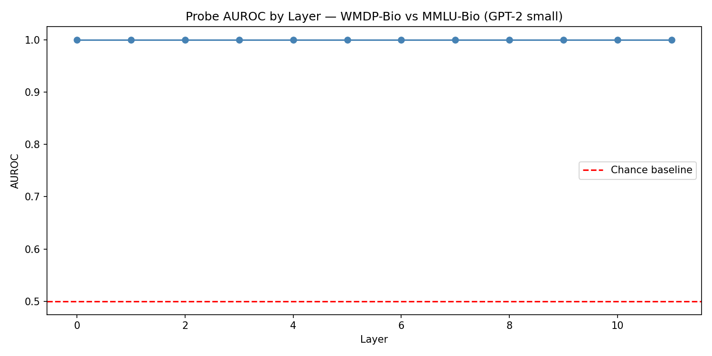

# Activation Probes for Dual-Use Biology Content

**Status: work in progress.** Capstone project for the TARA (Technical Alignment Research Accelerator) Sydney cohort, Sep–Dec 2026. Independent work by Vanessa Gurie. Preliminary results are in. See Results section below.

## The question

Can a simple linear probe, trained on a language model's internal activations, tell when the model is processing dual-use biology content? And does it still work when the wording changes or would slip past a keyword filter?

## Why it matters

Most AI safety checks happen before a model is released. After release, oversight mostly relies on filtering inputs and outputs. My policy work ([Closing the Last Door](https://vanessagurie1.substack.com/p/closing-the-last-door-the-case-for)) argues that frontier AI governance is missing a post-deployment monitoring layer, like the one pharmacovigilance provides for medicines.

Activation probes are one candidate for that layer. They are cheap, they can run in real time, and they read the model's internal representations rather than the surface text. This project tests how far a very simple probe gets.

## Approach

1. **Model.** Prototype on GPT-2 small, then scale to a small open-weight model (around 1B parameters) if time allows.
2. **Data.** Use a published safety benchmark rather than generating anything hazardous:
   - Positive class: questions from the biology split of [WMDP](https://www.wmdp.ai/), a benchmark built as a *proxy* for hazardous knowledge so that researchers do not need real uplift content.
   - Negative class: ordinary biology questions of similar length and style, from general knowledge benchmarks.
3. **Activations.** Run each example through the model with TransformerLens `run_with_cache` and take residual-stream activations at every layer, averaged over tokens.
4. **Probe.** Train a logistic regression classifier for each layer and compare performance across layers.
5. **Evaluation.**
   - AUROC on held-out examples
   - Generalisation to paraphrased questions
   - Comparison with a simple keyword baseline

## Progress

- [x] Project scoped; prior work reviewed
- [x] Activation extraction pipeline (GPT-2 small)
- [x] Dataset assembled and balanced (200 WMDP-bio / 200 MMLU-bio)
- [x] Layer-by-layer probe results (AUROC 1.0 across all layers — see caveat below)
- [x] Paraphrase and keyword-baseline tests
- [ ] Scale-up to a larger model
- [ ] Write-up

## Results

**Probe vs keyword baseline on paraphrased dual-use questions (n=20)**

| Method | Detected |
|--------|----------|
| Activation probe (layer 0, GPT-2 small) | 20/20 (mean confidence 0.963) |
| Keyword filter | 14/20 |



The probe detected all 20 paraphrased WMDP-bio questions, including 6 that contained no
keywords from a standard dual-use biology keyword list. This suggests the probe is reading
something in GPT-2's internal representations beyond surface vocabulary.

**Caveat:** AUROC of 1.0 on the held-out test set indicates possible stylistic differences
between WMDP and MMLU beyond content. The paraphrase result is the more meaningful
generalisation test. Results on GPT-2 small may not carry to frontier models, and WMDP
is a proxy dataset, not real uplift content.

## Known limitations

- **Input.** Version 1 detects content the model is *reading*. Monitoring what the model is *about to generate* is the harder, later step.
- **Dataset shortcuts.** The positive and negative sets come from different sources, so a probe could learn their style instead of their meaning. The paraphrase test and matched negatives are there to check. 
- **Proxy data.** WMDP is a proxy for hazardous knowledge. Good results on it would not prove the probe catches real misuse.
- **Scale.** Findings on small models may not carry over to frontier models.

## Responsible data handling

This repository contains no hazardous content. It uses only publicly released benchmark questions and does not generate, collect or store synthesis or uplift material.

## Setup

```bash
pip install "transformer_lens==2.17.0" "transformers<5" scikit-learn.
```

These versions are pinned because newer ones caused import errors in Colab.

## Related work

- Zou et al. (2023). *Representation Engineering: A Top-Down Approach to AI Transparency.*
- Li et al. (2024). *The WMDP Benchmark: Measuring and Reducing Malicious Use with Unlearning.*
- Anthropic (2024). *Simple probes can catch sleeper agents.*
- McKenzie et al. (2025). Probes for detecting high-stakes interactions.

## Contact

Vanessa Gurie · [LinkedIn](https://www.linkedin.com/in/vanessa-gurie)
